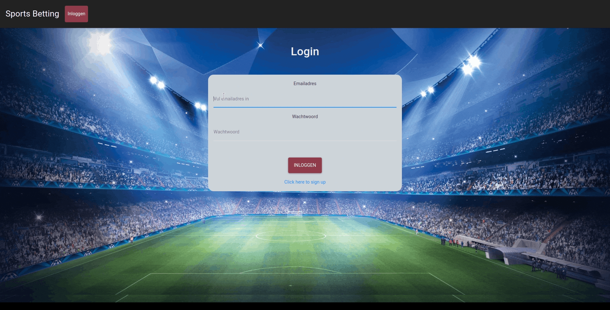

# Sports betting app :soccer:

### Table of contents

- [ABOUT](#about)
- [THE APP](#the-app)
- [GOALS](#goals)
- [USER STORIES](#user-stories)
- [TECHNOLOGIES](#technologies)
- [DEMO](#demo)
- [SETUP](#setup)

## ABOUT :woman_cartwheeling:

Hello! My name is Michelle and this is the portfolio project that I'm creating during my studies at [Codaisseur](https://github.com/Codaisseur). It's a sports betting app, specially made for my brother. It's purely for entertainment purposes for him and his friends during the Eredivisie league. The fun part is, I don't even like football/ soccer (don't want to start a discussion on the correct terminology of the sport :v:), I just love my brother (and I like to build apps).

## THE APP :soccer:

The Sports betting app is an MVP, not a final version. The beginning of the web app is there, but there is so much more on my wishlist. Take a look at my [projectboard](https://github.com/users/mipes4/projects/1) to know what is going to be done in the future.

As a user of the Sports betting app you can create predictions on the matches in the upcoming rounds of the Eredivisie and earn points with (partially) right predictions. There is a winner per round and a winner of the entire season if a player opted in for the 'Totaaltoto'.

- [Wireframe](https://sportsbetting-mp.netlify.app/)
- [UML diagram](https://app.lucidchart.com/invitations/accept/8e144874-00d5-4771-8025-ca02ef440cc1)
- [Back End Repo](https://github.com/mipes4/sportsbetting_be)

## GOALS :goal_net:

- Practice full-stack development
- Apply what I've learned so far
- Explore some new territory on my own
- Having an individual portfolio project that shows my technical abilities
- Creating the app for a 'customer'
  - Have an appointment to talk through the ideas
  - Manage expectations
  - Come up with a satisfying plan and wireframe
  - Meet the expectations
- Simulate working in the real world
  - Plan a project and work with user stories and tasks
  - Work with version controle like a pro

## USER STORIES :bookmark_tabs:

- As a user interested in football and Eredivisie I want to do my sports bets of the Eredivisie among frieds, so we can make the matches more fun to watch and maybe win a little money.
- As a user of the sports betting web app I need to know the game rules so I know how to earn points and money.
- As an admin user of the sports betting web app I need to set up user accounts for people who want to join so that I can be in charge of who can join the group and who not.
- As a user who's willing to win I'd like to see the scoreboard of all users and total of points so I can compare my predictions and score with the other users.
- As a user who'd like to stay up to date with one glance at a page I want to see a quick overview of the most important need to knows of our sports betting.
- As a user with interests in football and Eredivisie I'd like to do my bettings on a stylish, responsive, intuitive website so I enjoy the sports betting even more.
- As a user who wants to have fun among friends with our shared interest football I'd like to share my club preference so we can talk about that.
- As a user who has a shared interest of football and Eredivisie I'd like to chat with my friends about it.
- As a user who wants to join this Sports betting group of friends for multiple seasons I would like to have a history of the Eredivisie league with bets and scores that I can look into.

## TECHNOLOGIES :hammer_and_wrench:

**Front End**

- Node.js
- React
- Redux
- Axios
- Moment
- React-Bootstrap
- Bootswatch
- SCSS

**Back End**

- Express
- Axios
- REST
- Sequelize
- Postgres
- Middleware

## :sparkles::sparkles: DEMO :sparkles::sparkles:

## SETUP :electric_plug:

This project was bootstrapped with [Create React App](https://github.com/facebook/create-react-app).

**Look for the server side of this project at the [Back End repo](https://github.com/mipes4/sportsbetting_be)**

### Available Scripts

In the project directory, you can run:

#### `npm start`

Runs the app in the development mode. 
Open [http://localhost:3000](http://localhost:3000) to view it in the browser.

The page will reload if you make edits. 
You will also see any lint errors in the console.

#### `npm test`

Launches the test runner in the interactive watch mode. 
See the section about [running tests](https://facebook.github.io/create-react-app/docs/running-tests) for more information.

#### `npm run build`

Builds the app for production to the `build` folder. 
It correctly bundles React in production mode and optimizes the build for the best performance.

The build is minified and the filenames include the hashes. 
Your app is ready to be deployed!

See the section about [deployment](https://facebook.github.io/create-react-app/docs/deployment) for more information.

#### `npm run eject`

**Note: this is a one-way operation. Once you `eject`, you can’t go back!**

If you aren’t satisfied with the build tool and configuration choices, you can `eject` at any time. This command will remove the single build dependency from your project.

Instead, it will copy all the configuration files and the transitive dependencies (webpack, Babel, ESLint, etc) right into your project so you have full control over them. All of the commands except `eject` will still work, but they will point to the copied scripts so you can tweak them. At this point you’re on your own.

You don’t have to ever use `eject`. The curated feature set is suitable for small and middle deployments, and you shouldn’t feel obligated to use this feature. However we understand that this tool wouldn’t be useful if you couldn’t customize it when you are ready for it.

#### `npm run build` fails to minify

This section has moved here: https://facebook.github.io/create-react-app/docs/troubleshooting#npm-run-build-fails-to-minify
